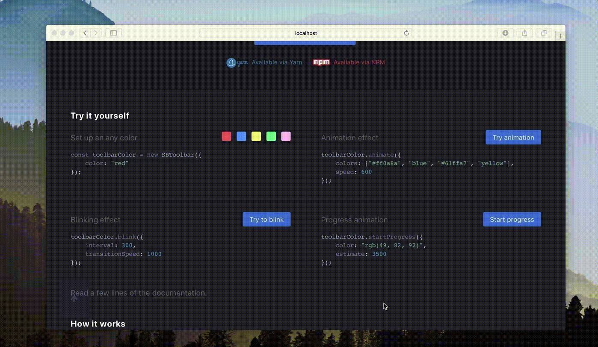

# Safari Beauty Toolbar

Tiny JavaScript module that makes the Safari Toolbar colorful. It uses native toolbar's transparency so there are two restrictions:

- Works only at the Safari on MacOS or iOS
- Displays after some scroll offset

## Installation

Install module via Yarn

```shell
yarn add safari-beauty-toolbar
```

or with NPM

```shell
npm i safari-beauty-toolbar --save
```

You can also download [build/sct.min.js](https://github.com/neSpecc/safari-beauty-toolbar/blob/master/build/sct.min.js) and manually connect it with your project.

## Usage 

Basic usage is quite simple: just pass your brand color to the constructor.

```js
const toolbarColor = new SBToolbar({
  color: "red"
});
```

param | type | default | description
-- | -- | -- | --
`color` | _string_ | - | Toolbar color. **Required**

This makes the Toolbar colorful. Try to reload the page and scroll it down.  

> Note. Because of transparency value of the Toolbar, you probably should pass little more saturated color than the usual brand's color.

> Note. Place the initialization code at the bottom of `<body>`-tag or call after document-ready event.  


## Public methods

There are some additional methods that your can find useful in some cases.

- [Blinking](#blinking)
- [Animation](#animation)
- [Progress](#progress)
- [Reinit](#reinit)
- [Stop Blinking](#stop-blinking)
- [Stop Animation](#stop-animation)
- [Stop All Effects](#stop-all-effects)
- [Destroy](#destroy)


### Blinking


```js
blink({interval, transitionSpeed})

```

Parameters passed as the destructuring assignment.

param | type | default | description
-- | -- | -- | --
`interval` | _number_ | 400 | time between transparent and opaque color in ms
`transitionSpeed` | _number_ | 500 | speed of transparency changing in ms

Usage example

```js
toolbarColor.blink({
  interval: 300,
  transitionSpeed: 1000
});
```

### Animation


```js
animate({colors, speed})

```

Parameters passed as the destructuring assignment.

param | type | default | description
-- | -- | -- | --
`colors` | _string[]_ | - | list of colors to change. **Required**.
`speed` | _number_ | 800 | speed of color transition in ms

Usage example

```js
toolbarColor.animate({
  colors: ["#ff0a8a", "blue", "#61ffa7", "yellow"],
  speed: 600
});
```

### Progress



Method allowed to use Toolbar's underlayer as a progressbar.

Before some process starts, call 

```js
startProgress({color, estimate})

```

and after finish, call 

```js
stopProgress() 
```

The first method begins to increase with of the underlayer up to 90% and stop there for waiting `stopProgress`. 
For better experience your can pass average time of the process via `estimate` option.  

param | type | default | description
-- | -- | -- | --
`color` | _string_ | #05c7ff | loader color
`estimate` | _number_ | 3500 | average time of the process

Usage example

```js
/**
 * Call before the process (for example, AJAX request)
 */
toolbarPane.startProgress({
  color: "#05c7ff",
  estimate: 3500
});

/**
 * Call after the process will be finished
 * We use the timeout for the demonstration
 */
setTimeout(function(){
  toolbarPane.stopProgress();
}, 4850);
```


### Reinit

Can be used to reinitialize the Module with new options

```js
reinit({color}) 
```

param | type | default | description
-- | -- | -- | --
`color` | _string_ | - | Toolbar color. **Required**


### Stop blinking

Used to stop blinking effect

```js
stopBlinking() 
```


### Stop animation

Used to stop the animation

```js
stopAnimation() 
```


### Stop all effects

Combines `stopBlinking`, `stopAnimation` and `stopProgress` 

```js
stopAllEffects() 
```


### Destroy

Totally removes all Module's stuff.

```js
destroy() 
```


